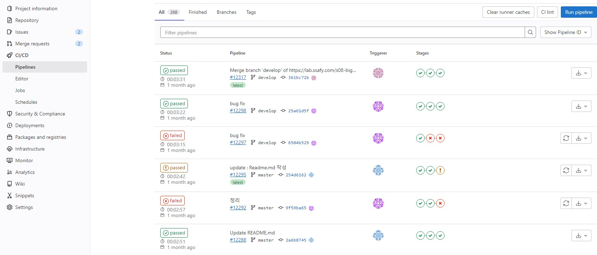
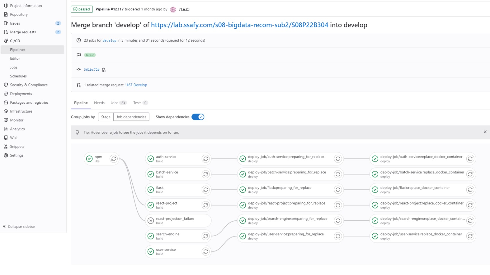
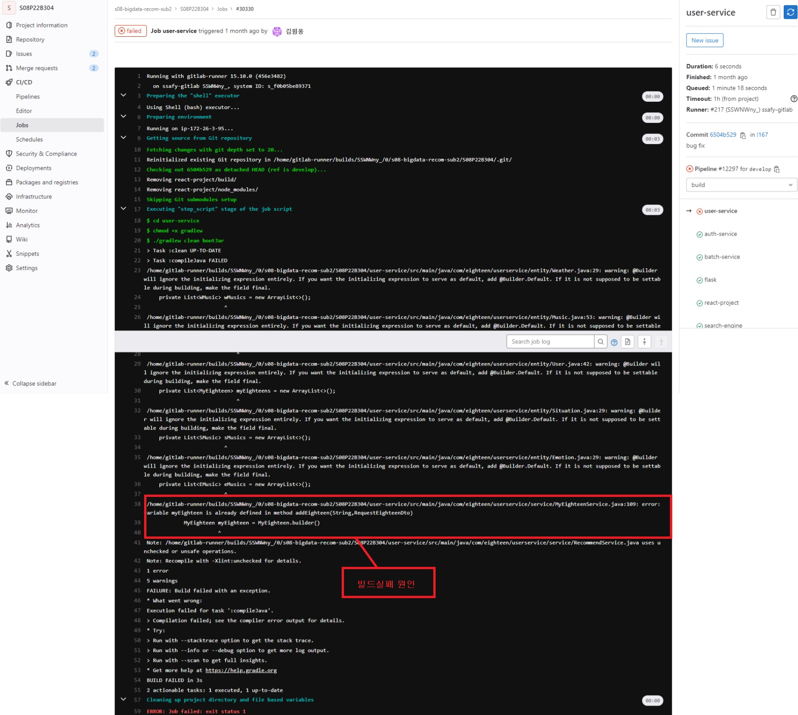

<h1 style="text-align: center;">✨EIGHTEEN✨</h1>

<div style="text-align: center; margin-bottom: 16px;">
<h2>너도 몰랐던 너의 에이틴!</h2>
에이틴은 노래방 노래 추천 플랫폼입니다.
</div>


---

<h1 style="text-align: center;">MAIN SERVICE</h1>


## 1. 사용자 애창곡기반 노래 추천

<div style="display: flex; flex-wrap: wrap;">
<div style="display: flex; justify-content: center; width:100%; margin-bottom: 16px;">

</div>

사용자가 등록한 애창곡 정보를 기반으로 노래를 추천드립니다.

**협업필터링**을 기반으로 유사한 사용자들의 애창곡 정보를 토대로, 사용자가 선호할만한 노래를 추천합니다.

</div>
<br/>

## 2. 날씨·기분·상황별 노래 추천

<div style="display: flex; flex-wrap: wrap;">
<div style="display: flex; justify-content: center; width:100%; margin-bottom: 16px;">


</div>

날씨, 기분, 상황별 어울리는 노래를 추천드립니다.

**컨텐츠 기반 필터링**을 통해 선택한 태그와 어울리는 노래를 추천합니다. 애창곡을 아직 등록하지 않은 사용자도 이용할 수 있습니다!

</div>
<br/>

## 3. 성별·연령별 애창곡 랭킹 제공

<div style="display: flex; flex-wrap: wrap;">
<div style="display: flex; justify-content: center; width:100%; margin-bottom: 16px;">

</div>

에이틴만의 애창곡 랭킹을 확인해보세요!

사용자들이 등록한 애창곡 정보를 토대로 **성별**, **연령대**별 애창곡 랭킹을 확인할 수 있습니다.

</div>
<br/>

<br/>

<h1 style="text-align: center;">Co-work tool</h1>

## 개발환경

- 형상관리 : Gitlab
- 이슈관리 : Jira
- 커뮤니케이션 : Mattermost, Notion
- 디자인 : Figma

## 🛠 기타 편의 툴

- Postman

<br/>

<h2 style="text-align: center;">🎨Front-end Stack🎨</h2>

- IDE : Visual Studio Code 1.76.2
- language
  - Typescript 4.9.5
  - node js 18.13.0
- Framework
  - react 18.2.0
- Http : Axios 1.3.4
- API
- router : react-router-dom 6.9.0
- state management tool
  - recoil 0.7.7
- dependencies

```json
    "@testing-library/jest-dom": "^5.16.5",
    "@testing-library/react": "^13.4.0",
    "@testing-library/user-event": "^13.5.0",
    "@types/jest": "^27.5.2",
    "@types/node": "^16.18.16",
    "@types/react": "^18.0.28",
    "@types/react-dom": "^18.0.11",
    "@types/styled-components": "^5.1.26",
    "axios": "^1.3.4",
    "date-fns": "^2.29.3",
    "eslint-plugin-prettier": "^4.2.1",
    "lottie-web": "^5.10.2",
    "moment": "^2.29.4",
    "prettier": "^2.8.4",
    "react": "^18.2.0",
    "react-datepicker": "^4.10.0",
    "react-dom": "^18.2.0",
    "react-icons": "^4.8.0",
    "react-infinite-scroll-component": "^6.1.0",
    "react-router-dom": "^6.9.0",
    "react-scripts": "5.0.1",
    "recoil": "^0.7.7",
    "styled-components": "^5.3.9",
    "swiper": "^9.1.1",
    "typescript": "^4.9.5",
    "web-vitals": "^2.1.4"
```

## Back-end Stack

- IDE : Intellij IDEA 2020.3, visual studio
- language : Java openjdk 17.0.6, python 3.8
- Springboot 2.7.8
- Spring Data JPA
- Lombok
- Spring Security
- Spring Oauth2
- Spring Web
- Spring batch
- Elk stack (ES, logstash, Kibana)
- Build tool : Gradle 7.6
- Swagger 2.9.2
- com.auth0:java-jwt 3.10.2
- Flask 2.2.3
- MySQL With TLS
- PyMySQL
- scikit-learn
- scikit-surprise
- SQLAlchemy
- DB
  - Mysql 8.0.32

<br/>

<h1 style="text-align: center;">✨기술 특이점✨</h1>

## 🎯 MSA 설계

### 배포

서비스별 배포가 가능.(배포시 전체 서비스의 중단이 없음)
특정 서비스의 요구사항만 반영하여, 빠르게 배포 가능.
확장

다양하고, 새로운 서비스에 대한 유연한 확장 가능.
장애

일부 서비스의 장애가 전체 서비스로 확장될 가능성을 차단. (User service 에 해당하는 장애가 Owner service에 영향을 미치지 ❌)
부분적 장애에 대한 격리 처리 가능.

### CI/CD

gitlab runner으로 CI/CD를 gitlab에서 제어가능 & 팀원과 CI/CD 진행상황 공유가능
  
1) Gitlab CI/CD Dashboard
>   
---
2) Gitlab CI/CD Process on dashboard
>   
---
3) Gitlab CI/CD Job Process Detail
>   

## 🎯 Elk stack

Elastic Search의 인덱싱 기능을 사용해서 검색속도를 높히면서 DB의 부하를 줄였다
초성 검색 등 세부적인 검색이 가능하다!

## 🎯 추천 알고리즘

1. Decision Tree
2. StandardScaler
3. GaussianNB
4. SVD
